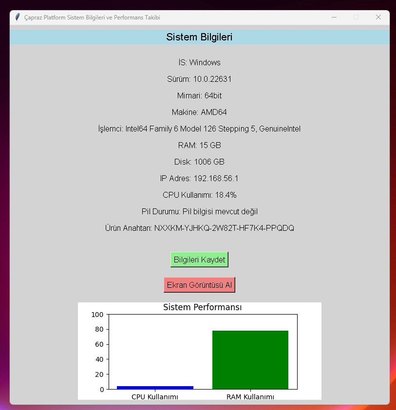
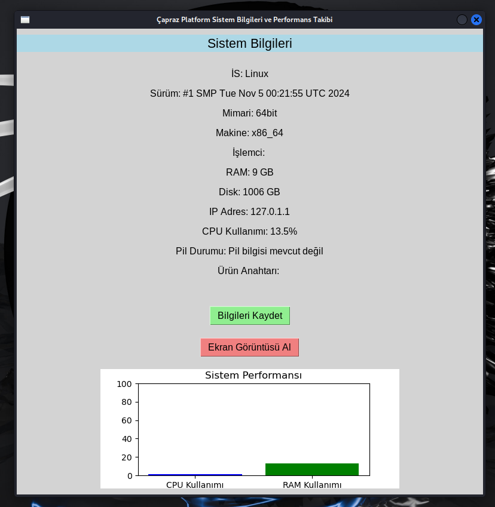

# System_info_GUI
Gives Detailed System Information Gives CPU and RAM Information with Graphics Exports and Saves Screenshots Written in Python.

Install Git Clone and Python3

Github Package Must Be Installed On Your Device.
```bash
sudo apt install git -y
```
Python
```bash
sudo apt install python3 -y
```
----------Required Libraries----------

Tkinter
```bash
sudo apt-get install python3-tk
```

pywin32
```bash
pip install pywin32
```

----------------------------------
https://fatihonder.org.tr/python-ile-sistem-bilgisi-uygulamasi/

# Installation
Install System_info_GUI


```bash
sudo git clone https://github.com/cektor/System_info_GUI.git
```
```bash
cd System_info_GUI
```

```bash
python system_info.py
```
or

```bash
python3 system_info.py

```

# To compile

NOTE: For Compilation Process pyinstaller must be installed. To Install If Not Installed.

pip install pyinstaller 

Linux Terminal 
```bash
pyinstaller --onefile --windowed system_info.py
```

Windows VSCode Terminal 
```bash
pyinstaller --onefile --noconsole system_info.py
```

MacOS VSCode Terminal 
```bash
pyinstaller --onefile --noconsole system_info.py
```

# To run directly on Windows or Linux
Download and Run According to Your Operating System from the Link

https://github.com/cektor/System_info_GUI/releases/tag/1.0


# Windows Screenshot

 

# Linux Screenshot

 
